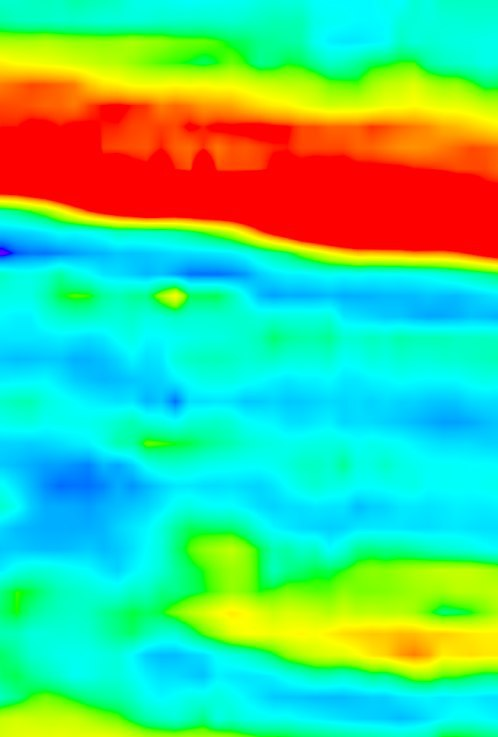
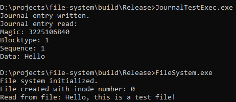
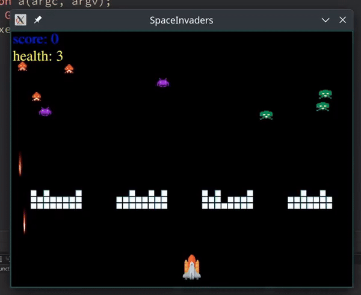
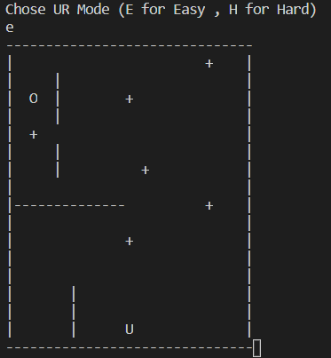

# cpp_projects

This repository contains my C++ and Qt projects that showcase different functionalities, ranging from data communication systems to game development . Below is a summary of each project.

---

## 1. UDP DataGenerator
A real-time data generator with live chart visualization, built for testing UDP data communication. The project allows users to control single and multiple data streams, with real-time chart updates for analysis.
[Read More](udp_datagenerator/README.md)

## 2. OPCUA DataStreamer
An OPC UA data streamer that collects data from industrial devices and streams it to a centralized location. The project emphasizes high throughput and reliable data transfer.
[Read More](opcua_datastreamer/README.md)

## 3. Image Renderer
A graphics rendering engine built to generate images from 3D models. It includes customizable shaders, lighting effects, and textures, providing a foundation for rendering high-quality graphics in C++.
[Read More](image_renderer/README.md)

## 4. BMinor Compiler
A compiler designed to parse and compile the BMinor language using  c language. It features extensive error handling, optimization passes, and intermediate code generation.
[Read More](BMinor-Compiler/README.md)

## 5. Model Runner
A versatile model runner designed for handling machine learning models with a focus on performance and scalability. It can load and run models, offering customizable support for different datasets and metrics.
[Read More](model_runner/README.md)

## 6. File System
This project simulates an EXT4-like file system in C++. It includes classes for managing inodes, block groups, and journaling to ensure data consistency and file access control with journaling to ensure data integrity.
[Read More](file-system/README.md)

## 7. Semi Redis
A simplified Redis-like key-value data store implemented in C++ using sockets. It supports basic operations like storing, retrieving, and deleting data, simulating core Redis functionalities in an easy-to-understand manner.
[Read More](semi_redis/README.md)

  

## 8. Space Invaders
A classic Space Invaders game recreated using the Qt framework.
[Read More](space_invaders/README.md)

## 9. Packman
A clone of the classic Packman game with added features like obstacle creation, multiple levels, and power-ups. The project uses SDL for graphics and user input handling.
[Read More](packman/README.md)

## 10. Circular Loading
A lightweight project focused on creating a circular loading animation using Qt.
[Read More](circular_loading/README.md)
