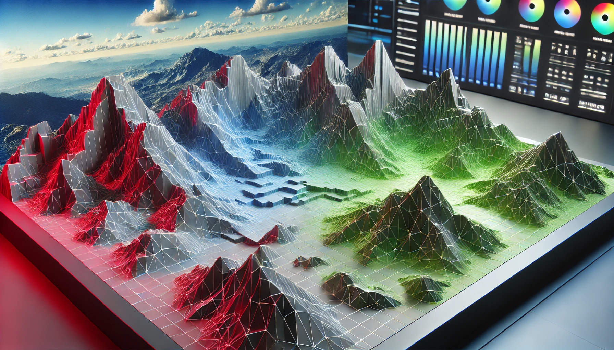

# **GPU-Based Image Renderer**

## **Project Overview**

This project implements an off-screen image rendering pipeline using OpenGL and EGL, optimized for running on GPU hardware. The core functionality revolves around rendering triangles and applying color gradients using vertex and fragment shaders. The result is an image that is generated entirely using the graphics card, providing fast and efficient rendering for large datasets or complex visualizations.



## **Rendering Process**

The rendering process begins with setting up an EGL context and creating an off-screen surface. The project uses the following steps to render images:

1. **Vertex Setup**: 
   - Vertices are defined with 3D positions (x, y, z) and color attributes (r, g, b, a).
   
2. **Shader Compilation**: 
   - The project uses vertex and fragment shaders to process the vertices and colors, applying transformations and interpolating the colors across the surface of the triangles.

3. **Off-Screen Context Creation**: 
   - EGL is used to create a rendering context without a display, enabling GPU-based off-screen rendering.
   
4. **Rendering**: 
   - The image is rendered using OpenGL commands, where the triangles are rasterized, and the final image is stored in memory.

5. **Image Generation**: 
   - The rendered image is copied from the GPU's memory to CPU memory and saved as a file (e.g., PNG format) for further use.

## **How to Compile and Run**

### **Dependencies**

- **C++ Compiler**: Any modern C++ compiler (e.g., GCC, Clang).
- **OpenGL**: A library for rendering 2D and 3D vector graphics.
- **EGL**: A native platform interface to create rendering contexts for OpenGL.
- **GLM**: OpenGL Mathematics library for handling transformations.
- **Qt**: for handling colors and images
- **CMake** (optional): If you want to build the project using a CMake build system.

### **Compilation Instructions**

#### **Using GCC**
1. Install the required libraries: OpenGL, EGL, GLM, and Qt.
   ```bash
   sudo apt-get install libegl1-mesa-dev libgl1-mesa-dev qtbase5-dev libglm-dev
   ```

2. Navigate to the project directory.
   ```bash
   cd image_renderer
   ```

3. Compile the project using g++:
   ```bash
   g++ -std=c++17 -o image_renderer main.cpp trianglerenderer.cpp renderegl.cpp renderegl2.cpp RenderOffScreen.cpp -lEGL -lGL -lQt5Widgets
   ```

#### **Using CMake**
Compile using CMake:
   ```bash
   mkdir build
   cd build
   cmake ..
   make
   ```

### **Running the Program**

Once compiled, you can run the project as follows:

```bash
./image_renderer
```

By default, the program will generate an image based on the predefined vertex and color data. The image will be saved in the same directory as the executable.
