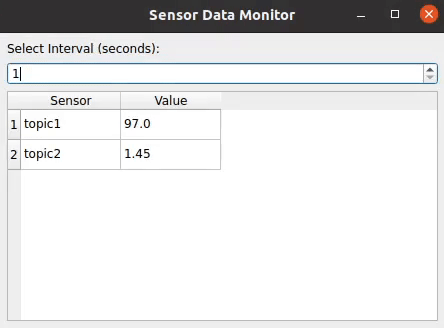

# OPC-UA Data Streamer

This project is designed to stream data from predefined topics to an OPC-UA server. The topics and nodes are defined in the `node_info.txt` file, where each node corresponds to a specific OPC-UA topic. The project reads data from these topics and streams it to the OPC-UA server for further processing.


### How the Code Works

1. **Node Information**: The `node_info.txt` file contains the node IDs and their corresponding topics in the OPC-UA server.
2. **Data Input**: The project can read data from an Excel file (`input_data.xlsx`), which is then used to update the topics in the OPC-UA server.
3. **Data Streaming**: The `main.py` script is responsible for connecting to the OPC-UA server and streaming the data. It fetches the data from the provided input file and writes it to the corresponding OPC-UA node based on the node information provided in the `node_info.txt` file.
4. **Topic Data Generation**: The `pyGenerator_opcua.pyproject` file contains the logic to simulate data or fetch real-time data for each topic, which is then streamed to the OPC-UA server.

---

## Setup Guide


1. **Install Dependencies**:  
   Run the following command to install the dependencies:

   ```bash
   pip install -r requirements.txt
   ```

2. **Prepare Input Data**:
   Ensure that your input data file (`input_data_small.xlsx`) contains the necessary information for streaming to the OPC-UA server.

3. **Configure Node Information**:
   modify the `node_info.txt` file to include the correct node IDs and topics for your OPC-UA server.

4. **Run the Project**:  
   Use the following command to run the main script:

   ```bash
   python main.py
   ```
