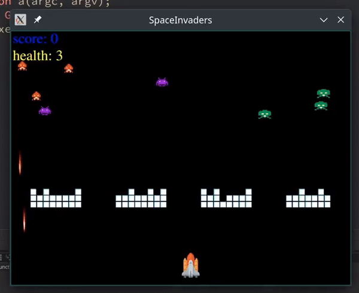

# Space Invaders Game

This is a simple **Space Invaders** game built using **Qt**. The player controls a spaceship that can move left and right and shoot bullets to destroy incoming enemies. The game includes multiple enemies with different behaviors, walls for defense, and a score tracking system.


## How It Works

- The player can move the spaceship using the arrow keys and shoot bullets to destroy enemies.
- Enemies move across the screen and may shoot bullets back at the player.
- The player earns points by destroying enemies, and the game ends when all enemies are defeated.
- Walls act as shields, blocking enemy and player bullets until they are destroyed.
- Health and score are displayed on the screen, and background music plays during gameplay.

## Project Structure

- `Game.cpp`: Handles the overall game setup (scene, player, enemies, walls, etc.).
- `Player.cpp`: Manages the player's movement and shooting logic.
- `Enemy.cpp`: Controls enemy behavior, including movement and firing.
- `Bullet.cpp`: Implements bullet behavior, including collisions.
- `Wall.cpp`: Defines the destructible walls.
- `Health.cpp` & `Score.cpp`: Display and update the player's health and score.
- `main.cpp`: Entry point to start the game.
- `MainWindow.cpp`: Sets up the main window for the game using Qt.

## Installation Guide

### Prerequisites
- Qt Framework installed on your machine.
- A C++ compiler (like `g++`).

### Steps
1. Clone this repository:
   ```bash
   git clone https://github.com/Ali-Noghabi/Qt_projects.git
   ```
2. Navigate to the project directory:
   ```bash
   cd space-invaders
   ```
3. Build the project:
   - Open the project in **Qt Creator** and build from there **OR**
   - Use the following command:
     ```bash
     qmake && make
     ```
4. Run the game:
   - If using Qt Creator, click **Run**.
   - From the terminal:
     ```bash
     ./SpaceInvaders
     ```

Enjoy playing Space Invaders!
