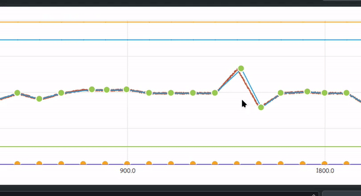

## Project Overview
UDP DataGenerator is a real-time data generator that uses live charts to visualize and control data streams. It transmits data over UDP, allowing users to adjust parameters and immediately see the effects on the chart, making it ideal for testing and monitoring data communication. The charts allow users to control both single and multiple data streams simultaneously.

## Key Features
- **UDP Data Transmission**: Generates and sends data over UDP.
- **Live Chart Visualization**: Real-time data display with adjustable parameters.
- **Single and Multiple Data Control**: Manage and control both single and multiple data streams from the UI.

## Setup Guide

### Prerequisites
- **Qt Framework (Qt 6 or Qt 5)**
- **CMake** 3.5+
- **C++17**

### Library Installation

For Linux:
```bash
sudo apt install qt6-base-dev qt6-charts-dev qt6-network-dev cmake g++
```

For macOS:
```bash
brew install qt cmake
```

### Build & Run

1. **Clone and Build**:
   ```bash
   git clone https://github.com/Ali-Noghabi/Qt_projects.git
   cd udp_data_generator
   mkdir build && cd build
   cmake ..
   make
   ```

2. **Run**:
   ```bash
   ./simulation_udp
   ```
